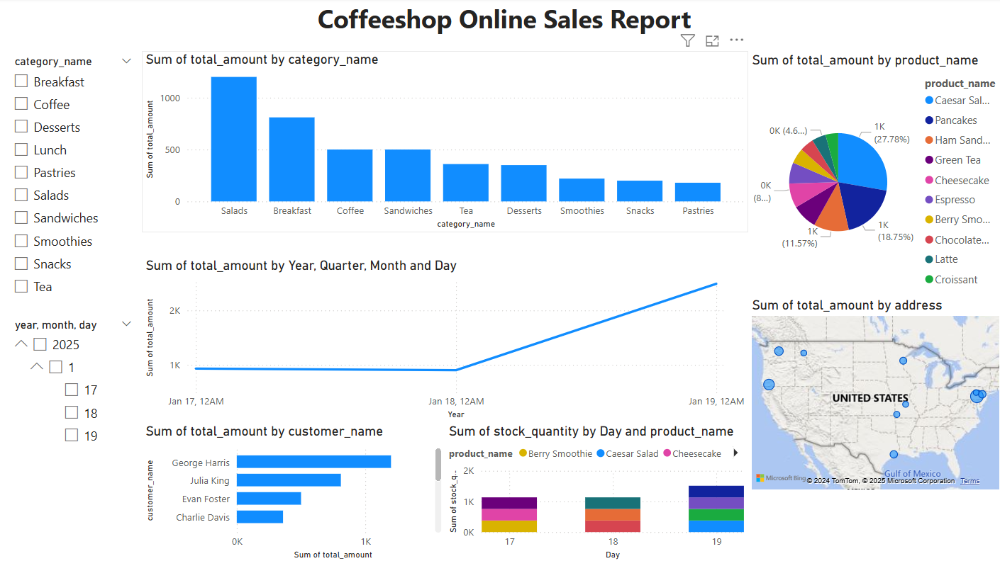
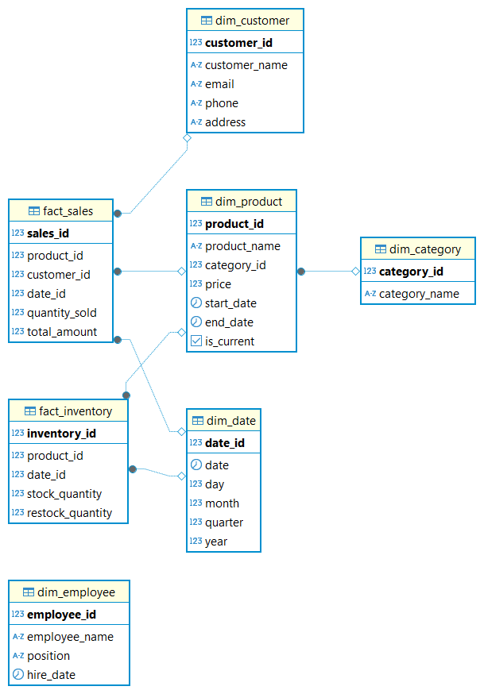

# Coffee Shop Online System - Data Analytics Project

## Project Overview
This project is a data system for coffee shop online system, it has transactional (OLTP) and analytical (OLAP) databases. The result is visualized PowerBI sales report

## Power BI report

## Technologies Used
- **Database:** PostgreSQL
- **Visualization:** Power BI (Windows)
- **ETL Process:** SQL-based scripts

## Project Components

### 1. OLTP Database
The OLTP database is designed to handle the transactional operations for the coffeeshop:
- `users`: Customer information
- `products`: Product details
- `categories`: Product categories
- `orders`: Customer orders
- `order_details`: Details of each order
- `cart`: Temporary cart information
- `payments`: Payment records
- `reviews`: Customer reviews

### 2. OLAP Database
- Fact tables:
  - `fact_sales`: Sales data
  - `fact_inventory`: Inventory data
- Dimension tables:
  - `dim_product`: Product information
  - `dim_category`: Product categories
  - `dim_customer`: Customer information
  - `dim_date`: Calendar data
  - `dim_employee`: Employee information

### 4. Visual Reports
Using Power BI, visual reports provide the following information:
- Sales by category, product, and date
- Top customers, and their map location
- Inventory

## How to run
### Prerequisites
- PostgreSQL installed and configured
- Power BI Desktop installed
- OTLP and OLAP databases are created
    - coffeeshop_online_otlp
    - coffeeshop_online_olap

### Steps
1. **Setup Databases:**
   - Execute SQL script to create tables for OTLP database: `create_tables_otlp.sql` and populate data `insert_data_otlp_reusable.sql`
   - Execute SQL script to creates tables for OLAP database: `create_tables_olap.sql`
2. **Run ETL Process:**
   - In this work ETL process is simulated via SQL script: `insert_data_olap.sql`
3. **Connect Power BI to PostgreSQL and generate report**
   - Use Power BI to connect to OLAP database
   - Import tables and create reports
   - See report example in `coffeesop_online_sales_report.pbix`

